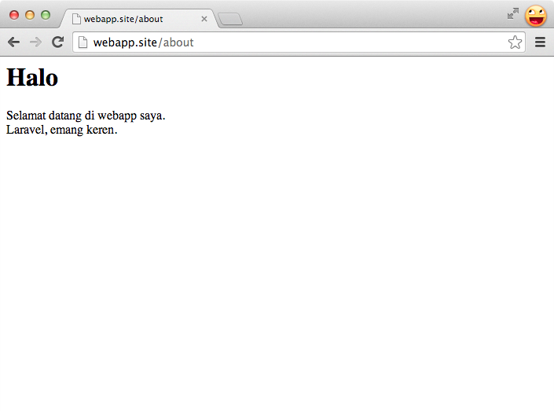
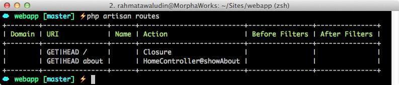
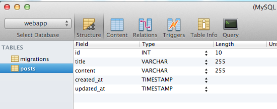
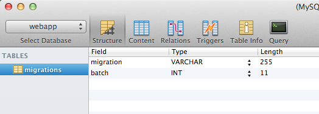
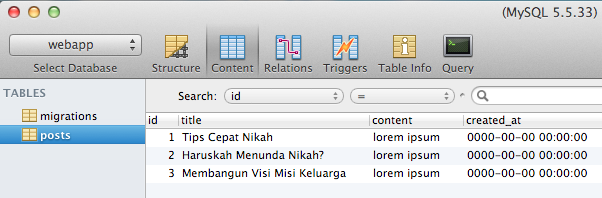

# Routing dan MVC

> Really, the web is pretty simple stuff. It's just request - response. I told myself this over and over again when building Laravel. I just want a simple way to catch requests and send out responses. That's it.

> *[Why Laravel? - Taylor Otwell](http://taylorotwell.tumblr.com/post/21038245018/why-laravel)*

Pada hari 2 ini, kita akan belajar struktur dasar dari sebuah aplikasi yang dibangun dengan framework Laravel. Untuk memudahkan, kita akan menggunakan aplikasi webapp yang dibuat di hari 1.

## Routing
Jika diibaratkan sebuah Mall, routing itu ibarat Bagian Informasi. Jika Anda bertanya lokasi toko Sepatu Wiwi, maka Bagian Informasi akan mengarahkan Anda ke toko tersebut.

Routing untuk Laravel dapat diatur pada file `app/routes.php`. Pada aplikasi yang lebih kompleks, kita dapat meletakan routing pada file lain agar `app/routes.php` tidak terlihat berantakan. Berikut isian dari `app/routes.php`:

{title="app/routes.php", lang="php", linenos=on}
~~~~~~~~
....
Route::get('/', function()
{
    return View::make('hello');
});
~~~~~~~~

Misalnya, jika kita ingin membuat halaman statis yang bisa diakses di `http://webapp.site/about`, tambahkan isian seperti ini pada `app/routes.php`:

{title="app/routes.php", lang="php", linenos=on}
~~~~~~~~
....
Route::get('/about', function() {
    return '<h1>Halo</h1>'
        .'Selamat datang di webapp saya '
        .'Laravel, emang keren.';
});
~~~~~~~~

Maka, kita dapat akses `http://webapp.site/about`.

Mari kita perhatikan syntax `Route::get('/about', function() { ... })`.

  * Parameter `get` menjelaskan jenis request yang diterima dalam contoh ini GET request. Kita dapat merubah `post` untuk mengakses POST request.
  * `/about` merupakan URL yang kita inginkan untuk diakses.
  * `function() { ... }` merupakan closure (anonymous function) yang akan memberikan jawaban atas request. Selain menggunakan closure, kita juga dapat mengarahkan request ke fungsi pada sebuah controller.

Untuk mengecek route apa saja yang telah kita buat, dapat menggunakan perintah berikut di terminal:

{linenos=off}
~~~~~~~~
$ php artisan routes
~~~~~~~~

Fitur routing ini sangat banyak, dan saya tidak akan menjelaskan semua fiturnya. Fitur lainnya akan saya jelaskan selama kita membuat sample aplikasi. Jika Anda tertarik mempelajari lebih jauh tentang routing, silahkan akses di [dokumentasi routing](http://laravel.com/docs/routing).

## MVC
Jika kita membuka folder `app/` akan kita temui tiga subdirektori yaitu `models/`, `views/`, dan `controllers/`. Ini menandakan bahwa Laravel mendukung penuh design arsitektur software secara **[Model View Controller (MVC)](http://id.wikipedia.org/wiki/MVC)** untuk memisahkan logic untuk *manipulasi data*, *antarmuka pengguna* dan *kontrol aplikasi*.

### Model
Model mewakili struktur data yang kita gunakan dalam aplikasi. Model ini dibuat berdasarkan objek dalam aplikasi kita. Misalnya, jika kita membuat aplikasi blog, maka `artikel` dan `komentar` dapat menjadi model. Selain sebagai struktur data, model juga menyimpan *business rules* dari aplikasi. Misalnya, dalam sebuah blog komentar minimal berisi 10 karakter, maka model komentar memastikan bahwa data yang isi sudah sesuai dengan aturan tersebut.

Ketika kita membahas model, pasti akan membahas tentang [database](http://laravel.com/docs/database). Laravel memiliki fitur menarik untuk manajemen database, diantaranya [migrations dan seeding](http://laravel.com/docs/migrations).

#### Migrations
Laravel memudahkan kita untuk membuat struktur database yang dapat disimpan dalam VCS semisal GIT. Dengan menggunakan migrations, perubahan struktur database selama pengembangan aplikasi dapat tercatat dan terdistribusikan ke semua anggota tim.

Mari kita buat migrations untuk membuat table Post dengan struktur:

{title="Struktur table Post"}
|Field      | Type             | Null | Key | Default             | Extra          |
| ----------|------------------|------|-----|---------------------|----------------|
|id         | int(10) unsigned | NO   | PRI | NULL                | auto_increment |
|title      | varchar(255)     | NO   | UNI | NULL                |                |
|content    | varchar(255)     | NO   | UNI | NULL                |                |
|created_at | timestamp        | NO   |     | 0000-00-00 00:00:00 |                |
|updated_at | timestamp        | NO   |     | 0000-00-00 00:00:00 |                |

1. Buka terminal, masuk ke folder webapp, jalankan perintah berikut:

    {linenos=off}
    ~~~~~~~~
    $ php artisan migrate:make create_posts_table
    ~~~~~~~~

2. Perintah diatas akan menghasilkan sebuah file, misalnya dengan nama `app/database/migrations/2014_03_26_033903_create_posts_table.php`. Ubah isian file ini menjadi:

    {title="app/database/migrations/2014_03_26_033903_create_posts_table.php", lang="php", linenos=on}
    ~~~~~~~~
    <?php
    use Illuminate\Database\Schema\Blueprint;
    use Illuminate\Database\Migrations\Migration;

    class CreatePostsTable extends Migration {
        /**
         * Run the migrations.
         *
         * @return void
         */
        public function up()
        {
            Schema::create('posts', function(Blueprint $table)
            {
                $table->increments('id');
                $table->string('title')->unique();
                $table->string('content');
                $table->timestamps();
            });
        }

        /**
         * Reverse the migrations.
         *
         * @return void
         */
        public function down()
        {
            Schema::drop('posts');
        }
    }
    ~~~~~~~~

3. Pada fungsi `up` diatas laravel akan membuat table posts. Sedangkan, pada fungsi `down`, laravel akan menghapus table posts.
4. Jalankan perintah ini untuk melakukan migrasi :

    {linenos=off}
    ~~~~~~~~
    $ php artisan migrate
    ~~~~~~~~

5. Cek pada database Anda, akan terdapat table `migrations` dan `posts`. Table `migrations` berfungsi untuk mencatat migrasi database yang telah kita lakukan. Table `posts` adalah table yang didefinisikan di file migrasi yang telah kita buat.

    

6. Untuk mendemonstasikan kegunaan migration, mari kita lakukan `rollback` untuk meng-*undo* migrasi yang yang telah kita lakukan. Jalankan perintah ini :

    {linenos=off}
    ~~~~~~~~
    $ php artisan migrate:rollback
    ~~~~~~~~

7. Cek kembali database Anda, maka table `posts` akan terhapus.

    

Sekarang berhenti sejenak, renungkan apa yang telah kita lakukan. Dengan menggunakan metode migrasi, struktur database dapat lebih dipahami dan di *maintenance*. Bandingkan jika menggunakan import/export file .sql. Tentunya cukup merepotkan jika struktur database sering berubah ketika develop aplikasi. Saran saya, gunakan migrasi untuk manajemen database selama pengembangan aplikasi dan export/import file sql ketika produksi.

Yang lebih powerfull, migrasi ini tidak hanya bisa menambah/menghapus table. Migrasi juga memungkinkan kita merubah struktur suatu table, misalnya menambah/hapus/ubah suatu kolom. Jika ingin belajar lebih lanjut tentang migrasi, kunjungi [dokumentasi migrasi](http://laravel.com/docs/migrations).

#### Database Seeder
Terkadang ketika kita mengembangkan sebuah aplikasi, dibutuhkan contoh data. Bisa saja contoh data tersebut kita inject langsung ke database, namun cukup merepotkan jika kita ingin menginject banyak data. Database Seeder berfungsi untuk membuat contoh data bagi aplikasi.

Mari kita buat database seeder untuk table `posts`:

1. Buatlah file `app/database/seeds/PostsTableSeeder.php` isi seperti berikut untuk menentukan contoh data yang akan kita masukkan ke dalam database:

    {title="app/database/seeds/PostsTableSeeder.php", lang="php", linenos=on}
    ~~~~~~~~
    <?php

    class PostsTableSeeder extends Seeder {

        public function run()
        {
            // kosongkan table posts
            DB::table('posts')->delete();

            // buat data berupa array untuk diinput ke database
            $posts = array(
                array('id'=>1, 'title'=>'Tips Cepat Nikah', 'content'=>'lorem ipsum'),
                array('id'=>2, 'title'=>'Haruskah Menunda Nikah?', 'content'=>'lorem ipsum'),
                array('id'=>3, 'title'=>'Membangun Visi Misi Keluarga', 'content'=>'lorem ipsum')
            );

            // masukkan data ke database
            DB::table('posts')->insert($posts);
        }

    }
    ~~~~~~~~

2. Tambahkan `PostsTableSeeder` ke dalam `app\database\seeds\DatabaseSeeder.php` :

    {title="app\database\seeds\DatabaseSeeder.php", lang="php", linenos=on}
    ~~~~~~~~
    <?php

    class DatabaseSeeder extends Seeder {

        /**
         * Run the database seeds.
         *
         * @return void
         */
        public function run()
        {
            Eloquent::unguard();

            $this->call('PostsTableSeeder');
        }

    }
    ~~~~~~~~

3. Untuk melakukan *seeding*, jalankan perintah ini:

    {linenos=off}
    ~~~~~~~~
    $ php artisan migrate
    $ php artisan db:seed
    ~~~~~~~~

4. Cek kembali database, maka contoh data telah masuk ke dalam database.

    

> Tips: Jika database telah terisi dengan data dari aplikasi dan Anda ingin mereset ke kondisi setelah seeding, gunakan perintah `php artisan migrate:refresh --seed`

### Membuat Model
Model dalam Laravel dibuat dengan cara melakukan *extends* class **Eloquent**. Mari kita buat model untuk mengakses table `posts` yang telah dibuat. Buat file `app/models/Post.php` dengan isi seperti berikut:

{title="app/models/Post.php", lang="php", linenos=on}
~~~~~~~~
<?php
class Post extends Eloquent {
    /**
     * white list column for mass asignment
     * @link http://laravel.com/docs/eloquent#mass-assignment
     * @var array
     */
    protected $fillable = ['title', 'post'];
}
~~~~~~~~

### Mengakses model
Model dapat diakses dengan langsung memanggil class model tersebut dimanapun kita butuhkan. Eloquent merupaka ORM (Object Relational Mapper) yang powerfull untuk manipulasi data. Berikut ini akan saya berikan beberapa contoh fitur Eloquent:

1. Buat route test pada file `app/routes.php` dengan isi sebagai berikut:

    {title="app/routes", lang="php", linenos=on}
    ~~~~~~~~
    Route::get('/testmodel', function() {
        $query = /* isi sample query */ ;
        return $query;
    });
    ~~~~~~~~

2. Pada beberapa contoh dibawah, silahkan ubah `/* isi sample query */` dengan contoh yang ingin dicoba. Untuk mengecek hasilnya, buka [http://webapp.site/test](http://webapp.site/test).

    * Mencari semua model:

    ~~~~~~~~
    Post::all();
    ~~~~~~~~

    * Mencari model berdasarkan id:

    ~~~~~~~~
    Post::find(1);
    ~~~~~~~~

    * Mencari model berdasarkan title:

    ~~~~~~~~
    Post::where('title','like','%cepat nikah%')->get();
    ~~~~~~~~

    * Mengubah record, (hapus semua isi function) :

    ~~~~~~~~
    $post = Post::find(1);
    $post->title = "Ciri Keluarga Sakinah"
    return $post;
    ~~~~~~~~

    * Menghapus record, (hapus semua isi function) :

    ~~~~~~~~
    $post = Post::find(1);
    $post->delete();
    // check data di database
    ~~~~~~~~

    * Menambah record, (hapus semua isi function) :

    ~~~~~~~~
    $post = new Post;
    $post->title = "7 Amalan Pembuka Jodoh";
    $post->content = "shalat malam, sedekah, puasa sunah, silaturahmi, senyum, doa, tobat";
    $post->save();
    return $post;
    // check record baru di database
    ~~~~~~~~

    * Penjelasan lengkap untuk beberapa syntax query berikut dapat ditemukan di [dokumentasi query builder](http://laravel.com/docs/queries) dan [eloquent](http://laravel.com/docs/eloquent).

## View
View atau istilah lainnya *presentation logic* berfungsi untuk menampilkan data yang telah kita olah di bussiness logic. Laravel memudahkan kita untuk membuat view. Mari kita ubah route `about` yang sudah dibuat menjadi view:

1. Ubah route `about` menjadi:

    {title="app/routes.php", lang="php", linenos=on}
    ~~~~~~~~
    Route::get('/about', function() {
        return View::make('about');
    });
    ~~~~~~~~

2. Buat file `app/views/about.php` dengan isi:

    {title="app/routes.php", lang="html", linenos=on}
    ~~~~~~~~
    <html>
        <body>
            <h1>Halo</h1>
            Selamat datang di webapp saya. 
            Laravel, emang keren.
        </body>
    </html>
    ~~~~~~~~

3. Cek kembali route `http://webapp.site/about` dan hasilnya, tetap sama. Yang berubah adalah *logic*-nya, sekarang kita memindahkan logic untuk menampilkan html ke file view terpisah.

### Template dengan Blade
Selain dengan memisahkan peletakan view pada file berbeda, Laravel juga lebih menekankan penggunaan view ini dengan templating. Dengan templating ini, developer akan 'terpaksa' hanya menggunakan syntax untuk tampilan dan logic sederhana pada *view* nya. Templating pada Laravel menggunakan [Blade](http://laravel.com/docs/templates).

Untuk menggunakan view dengan blade template, kita cukup merubah ektensi file view menjadi `.blade.php`. Pada contoh file `about.php`, maka kita ubah menjadi `about.blade.php` untuk menggunakan blade template.

#### Blade Syntax
Syntax yang paling sederhana dalam blade adalah `{{ }}` (double curly braces). Syntax ini dapat menggantikan fungsi `<?php echo ;?>` pada file view. Jadi, syntax `{{ $variabel }}` akan berubah menjadi syntax `<?php echo $variable; ?>`. Jika akan menampilkan variable hasil input user, gunakan `{{{ }}}` (triple curly braces) agar variable yang ditampilkan di escape (dibersihkan dari script) terlebih dahulu.

Selain mendukung control structures semisal @if, @for, @foreach, @while, @unless, dll untuk templating. Silahkan rujuk ke [dokumentasi resmi](http://laravel.com/docs/templates#other-blade-control-structures) untuk penjelasan lebih lengkapnya.

### Form
Membuat form di Laravel sangat mudah, berikut ini syntax dasar untuk membuat form:

~~~~~~~~
{{ Form::open(array('url' => 'post/save')) }}
    //
{{ Form::close() }}
~~~~~~~~

Membuat elemen-elemen form dalam Laravel juga sangat mudah, berikut ini contoh untuk menampilkan label dengan *placholder* E-Mail Address dan *class* awesome:

~~~~~~~~
{{ Form::label('email', 'E-Mail Address', array('class' => 'awesome')) }}
~~~~~~~~

Untuk membuat input :

~~~~~~~~
{{ Form::text('username') }}
~~~~~~~~

Penjelasan lebih lengkapnya, dapat diakses di [dokumentasi form](http://laravel.com/docs/html).

### Request
Data request yang dikirim ke aplikasi, dapat diambil menggunakan class Input. Contoh untuk mengambil $_GET / $_POST data dengan key 'username':

~~~~~~~~
$username = Input::get('username');
~~~~~~~~

Penjelasan lebih lengkapnya, dapat diakses di [dokumentasi request](http://laravel.com/docs/requests).

## Controller
Pada contoh-contoh sebelumnya, saya selalu meletakan logic di `app/routes.php`. Hal ini bisa saja dilakukan, tapi tidak efektif jika aplikasinya sudah besar. Cara yang sering digunakan adalah router mengarahkan request ke fungsi di controller. Nah, fungsi itulah yang akan melakukan logic untuk request tersebut dan memberikan response.

Mari kita praktekan, dengan mengubah route about ke fungsi `showAbout` di `HomeController.php` :

1. Ubah route '/about' menjadi :

    {title="app/routes.php", line="php", linenos=on}
    ~~~~~~~~
    ....
    Route::get('/about', 'HomeController@showAbout');
    ....
    ~~~~~~~~

2. Tambah fungsi `showAbout` pada class `HomeController` :

    {title="app/contollers/HomeController.php", line="php", linenos=on}
    ~~~~~~~~
    ....
    public function showAbout()
    {
        return View::make('about');
    }
    ....
    ~~~~~~~~

3. Akses kembali http://webapp.site/about, maka hasilnya akan tetap sama. Yang berubah adalah logic untuk memberikan response sekarang berada pada controller, router hanya mengarahkan request saja.

Fitur dari controller ini sangat banyak, diantaranya:

  * Filtering request yang datang
  * RESTfull untuk memetakan setiap fungsi pada controller menjadi routes
  * Resource Controller untuk membuat restfull controller pada sebuah model

Penjelasan lebih lengkapnya, dapat diakses di [dokumentasi controller](http://laravel.com/docs/controllers).

## Ringkasan
Pada hari 2 ini, saya harap Anda telah dapat memahami:

  * Konsep routing
  * Konsep MVC

Pada hari 3, kita akan memulai membuat perencanaan untuk project yang akan dibangun dengan framework Laravel. Semangat! :)